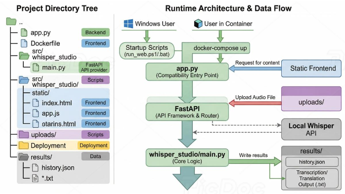

# Local Whisper Studio

A clean, local-first web UI for `faster-whisper`.

It lets users upload an audio file, run transcription or translation locally, track real processing progress, review timestamps and language confidence, and reopen cached results later from a history page.

This repository is now documented for new users who do not already have your personal Whisper environment.


## Features

- Upload audio from the browser
- Translate to English or transcribe in the original language
- Real progress bar based on processed audio duration
- Language detection and confidence display
- Timestamped segment timeline
- TXT export
- Persistent history page backed by disk cache
- Simple stack: FastAPI + vanilla HTML/CSS/JS

## Preview

- Workspace page for new uploads
- History page for old jobs
- Local model inference through `faster-whisper`

## Requirements

Choose one of these setups:

- Conda recommended for easiest local setup
- Docker supported for users who do not want to install Python dependencies manually

Notes:

- `faster-whisper` will download model files on first run
- `ffmpeg` is recommended for broader audio compatibility
- GPU use is optional; CPU mode works too, just slower

## Quick Start

### Option 1: Conda

```powershell
conda env create -f environment.yml
conda activate local-whisper-studio
python -m uvicorn app:app --app-dir . --host 127.0.0.1 --port 8010 --reload --reload-dir .
```

Open:

- [http://127.0.0.1:8010](http://127.0.0.1:8010)
- [http://127.0.0.1:8010/history](http://127.0.0.1:8010/history)

### Option 2: Python venv

Windows PowerShell:

```powershell
python -m venv .venv
.venv\Scripts\Activate.ps1
python -m pip install --upgrade pip
pip install -r requirements.txt
python -m uvicorn app:app --app-dir . --host 127.0.0.1 --port 8010 --reload --reload-dir .
```

### Option 3: One-click local script

Recommended for this repository.

The startup scripts now try Python environments in this order:

1. Project `.venv`
2. Local Conda environment named `whisper`
3. Currently activated Conda environment
4. System `python`

PowerShell:

```powershell
powershell -ExecutionPolicy Bypass -File .\scripts\run_web.ps1
```

Batch:

```bat
scripts\run_web.bat
```

Default port is `8010`.

If you already have a working Conda environment named `whisper`, the script should use it automatically.

If you prefer to activate it yourself first:

```powershell
conda activate whisper
powershell -ExecutionPolicy Bypass -File .\scripts\run_web.ps1
```

### Option 4: Docker

```powershell
docker compose up --build
```

Then open:

- [http://127.0.0.1:8010](http://127.0.0.1:8010)

Docker uses CPU mode by default:

- `WHISPER_DEVICE=cpu`
- `WHISPER_COMPUTE_TYPE=int8`

## Environment Variables

You can customize model behavior with:

```powershell
$env:WHISPER_MODEL_SIZE="turbo"
$env:WHISPER_DEVICE="cuda"
$env:WHISPER_COMPUTE_TYPE="float16"
```

Recommended presets:

- GPU: `cuda` + `float16`
- CPU: `cpu` + `int8`

## Project Structure

```text
.
|-- app.py
|-- README.md
|-- requirements.txt
|-- requirements-web.txt
|-- environment.yml
|-- Dockerfile
|-- docker-compose.yml
|-- examples/
|-- notebooks/
|-- scripts/
|   |-- run_web.ps1
|   `-- run_web.bat
`-- src/
    `-- whisper_studio/
        |-- main.py
        `-- static/
            |-- index.html
            |-- history.html
            |-- app.js
            `-- styles.css
```

## How It Works

### Real progress

The app estimates progress from real audio coverage:

1. Read total duration from the uploaded file
2. Track the `end` timestamp of each generated Whisper segment
3. Convert that to a visible progress percentage

This is much closer to real processing progress than a fake per-stage loading bar.

### History cache

Jobs are persisted to:

```text
results/history.json
```

TXT outputs are stored in:

```text
results/
```

That means users can restart the server and still browse prior results.

## API

### `POST /api/jobs`

Upload an audio file and start a job.

Query:

- `task=translate`
- `task=transcribe`

### `GET /api/jobs/{job_id}`

Returns live or completed job state, including:

- `progress`
- `processed_seconds`
- `duration_seconds`
- `detected_language`
- `language_probability`
- `segments`
- `text`

### `GET /api/history`

Returns the cached history list.

### `GET /api/jobs/{job_id}/download`

Downloads the TXT result for a completed job.

## Publishing Notes

If you publish this to GitHub, a new visitor should be able to do at least one of these without knowing your machine:

- create a Conda environment from `environment.yml`
- create a Python virtual environment and install `requirements.txt`
- run it in Docker with `docker compose up --build`
